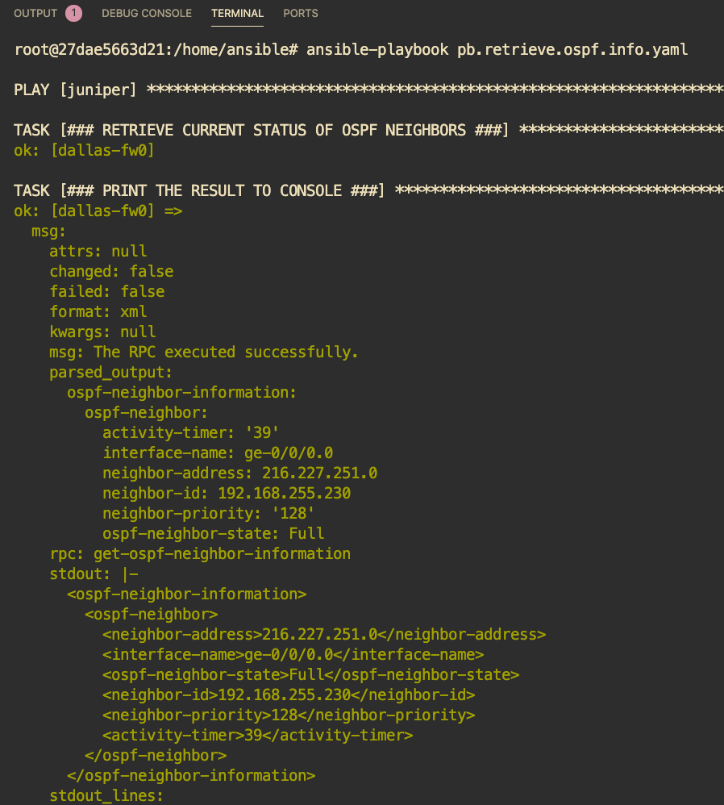

# Multivendor Example: Retrieve OSPF information

This example will show how to use Ansible to 

1. retrieve OSPF status from Juniper with the rpc `get-ospf-neighbor-information`
2. print the output to screen
3. retrieve OSPF status from Cisco by screen scraping the output of `show ip ospf neighbor`
4. print the output to screen
5. configure the Cisco device's hostname
6. print the result of our configuration task

## 🚀 `Executing the playbook`

This project provides two unique methods of executing the playbook:

1. Docker
2. Your own Python environment

### 🐳 `Docker`

1. build the container image with

```sh
make container
```

2. run the playbook within the container

```sh
make ansible
```

#### 〰️ `Notes about Docker`

If you are unsure if Docker is installed on your computer, then it's probably safe to suggest that it's not. If you're interested in learning more about the product, I encourage you to read a few blogs on the topic. A personal recommendation would be [Digital Ocean](https://www.digitalocean.com/community/tutorial_collections/how-to-install-and-use-docker#:~:text=Docker%20is%20an%20application%20that,on%20the%20host%20operating%20system.)

Some of the goodies placed in the `docker` folder are not relevant to our use case with Python. Feel free to delete them as you see fit, I simply wanted to share with you my Docker build process for all Juniper automation projects (including those based on Ansible). The world is your oyster and I won't judge you on whatever direction you take.

### 🐍 `Your own Python environment`

1. install python dependencies 

```sh
pip install -r docker/requirements.txt
```

2. change into Python directory 

```
cd ansible
```

3. install the official Juniper and Cisco Ansible modules

```sh
ansible-galaxy install juniper.junos
ansible-galaxy collection install cisco.ios
```

3. type in your terminal

```sh
ansible-playbook pb.retrieve.ospf.info.yaml
```

#### 〰️ `Notes about Python Virtual Environments`

Similar to Docker, if you are unsure if you're using Python Virtual Environment features, it is safe to suggest that you're not. You are *strongly* recommended to using a Python Virtual Environment everywhere. You can really mess up your machine if you're too lazy and say "ehh, that seems like it's not important". It is. If it sounds like I'm speaking from experience, well I'll never admit to it.

If you're interested in learning more about setting up Virtual Environments, I encourage you to read a few blogs on the topic. A personal recommendation would be

- [Digital Ocean (macOS)](https://www.digitalocean.com/community/tutorials/how-to-install-python-3-and-set-up-a-local-programming-environment-on-macos)
- [Digital Ocean (Windows 10)](https://www.digitalocean.com/community/tutorials/how-to-install-python-3-and-set-up-a-local-programming-environment-on-windows-10)

## 📝 `Dependencies`

Refer to the file located at [docker/requirements.txt](docker/requirements.txt)

## ⚙️ `How it works`

Fortunately Ansible's reliance on YAML allows us to document every step of the way. Let me know if any of the code below doesn't make sense and I'll make sure to not laugh.

```yaml
### ---------------------------------------------------------------------------
### Provision the Juniper devices
### ---------------------------------------------------------------------------
- hosts: juniper
  connection: local
  gather_facts: False
  become: False
  roles: 
    - juniper.junos
  vars:
    provider_info:
      host: "{{ inventory_hostname }}"
      user: "automation"
      passwd: "juniper123"

  tasks:
    - name: "### RETRIEVE CURRENT STATUS OF OSPF NEIGHBORS | STORE OUTPUT AS OBJECT `ospf` ###"
      juniper_junos_rpc:
        host: "{{ ansible_host }}"
        user: "{{ provider_info.user }}"
        passwd: "{{ provider_info.passwd }}"
        rpc: get_ospf_neighbor_information
      register: ospf

    - name: "### PRINT THE `ospf` OBJECT TO CONSOLE ###"
      debug:
        msg: "{{ ospf }}"

### ---------------------------------------------------------------------------
### Provision the Cisco devices
### ---------------------------------------------------------------------------
- hosts: cisco
  connection: local
  gather_facts: False
  become: False
  vars:
    provider_info:
      host: "{{ ansible_host }}"
      user: "automation"
      passwd: "juniper123"

  tasks:
    - name: "### RETRIEVE CURRENT STATUS OF OSPF NEIGHBORS | STORE OUTPUT AS OBJECT `ospf` ###"
      ios_command:
        provider:
          host: "{{ provider_info.host }}"
          username: "{{ provider_info.user }}"
          password: "{{ provider_info.passwd }}"
        commands: "show ip ospf neighbor"
      register: ospf

    - name: "### PRINT THE `ospf` OBJECT TO CONSOLE ###"
      debug:
        msg: "{{ ospf }}"

    - name: "### CONFIGURE THE DEVICE'S HOSTNAME | STORE OUTPUT OF TASK IN OBJECT CALLED `config` ###"
      ios_config:
        provider:
          host: "{{ provider_info.host }}"
          username: "{{ provider_info.user }}"
          password: "{{ provider_info.passwd }}"
        lines: "hostname {{ inventory_hostname }}"
      register: config

    - name: "### PRINT THE RESULT OF OUR CONFIG CHANGE TO CONSOLE ###"
      debug:
        msg: "{{ config }}"
```

## 📸 `Screenshot`


