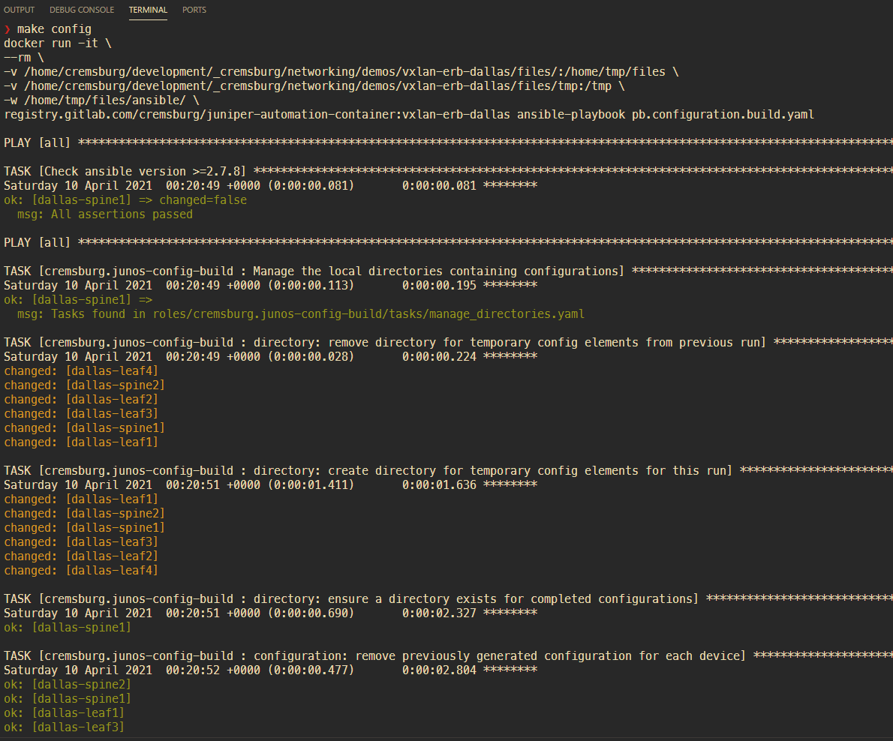

# Juniper VXLAN / EVPN Data Center: Ansible Playbook

[](https://www.juniper.net/documentation/solutions/en_US/campus)

## Overview

This example will show how to deploy a VXLAN / EVPN fabric with Ansible. 

In addition to the Ansible playboks, this project also ships with additional tools to help you along your way. You will find Ansible roles for generating configurations, a Dockerfile for running the project in an isolated environment, and a Makefile for those of us that hate typing out everything all the time.

### 〰️ `Additional information`

This project is based on *[Infrastructure-As-Code](https://dev.to/fedekau/infrastructure-as-code-a-beginners-perspective-2l8k)* concepts, where all elements of a device's configuration as stored in a format of `key:value` pairs and stored in a source-code management system such as Github or Gitlab. While not required for successful deployments, we at Juniper encourage network devops teams to *[leverage best practicies with git](https://dev.to/bholmesdev/git-github-best-practices-for-teams-opinionated-28h7)*.

The network designs available for you here are based upon *[Juniper's EVPN - VXLAN Guide](https://www.juniper.net/documentation/us/en/software/junos/evpn-vxlan/evpn-vxlan.pdf)*, feel free to take moment to review the the guide for a refresher on modern Data Center architectures.

## 🚀 `Executing the playbook`

This project provides two unique methods of executing the playbook:

1. Docker
2. Your own Python environment

### 🐳 `Docker`

1. build the container image with

```sh
make container
```

2. run the playbook to build the configurations within the container

```sh
make config
```

3. run the playbook to transfer and apply the configurations to the network devices

```sh
make apply
```

#### 〰️ `Notes about Docker`

If you are unsure if Docker is installed on your computer, then it's probably safe to suggest that it's not. If you're interested in learning more about the product, I encourage you to read a few blogs on the topic. A personal recommendation would be [Digital Ocean](https://www.digitalocean.com/community/tutorial_collections/how-to-install-and-use-docker#:~:text=Docker%20is%20an%20application%20that,on%20the%20host%20operating%20system.)

Some of the goodies placed in the `docker` folder are not relevant to our use case with Python. Feel free to delete them as you see fit, I simply wanted to share with you my Docker build process for all Juniper automation projects (including those based on Ansible). The world is your oyster and I won't judge you on whatever direction you take.

### 🐍 `Your own Python environment`

1. install python dependencies 

```sh
pip install -r docker/requirements.txt
```

2. change into Python directory 

```
cd ansible
```

3. build your configurations

```sh
ansible-playbook pb.configuration.build.yaml
```

4. review the generated configurations in `files/ansible/config/complete` directory

```sh
cat files/ansible/config/complete/dallas-leaf1.conf
```

5. push the configuration to the device and apply

```sh
ansible-playbook pb.configuration.apply.yaml
```

#### 〰️ `Notes about Python Virtual Environments`

Similar to Docker, if you are unsure if you're using Python Virtual Environment features, it is safe to suggest that you're not. You are *strongly* recommended to using a Python Virtual Environment everywhere. You can really mess up your machine if you're too lazy and say "ehh, that seems like it's not important". It is. If it sounds like I'm speaking from experience, well I'll never admit to it.

If you're interested in learning more about setting up Virtual Environments, I encourage you to read a few blogs on the topic. A personal recommendation would be

- [Digital Ocean (macOS)](https://www.digitalocean.com/community/tutorials/how-to-install-python-3-and-set-up-a-local-programming-environment-on-macos)
- [Digital Ocean (Windows 10)](https://www.digitalocean.com/community/tutorials/how-to-install-python-3-and-set-up-a-local-programming-environment-on-windows-10)

## 📝 `Dependencies`

Refer to the file located at [docker/requirements.txt](docker/requirements.txt)

## ⚙️ `How it works`

Let's take a second to do a nice John Madden play-by-play by visiting the documentation in the `docs/` directory.

Name | Description
---- | -----------
[pb.configuration.build.yaml](docs/pb.configuration.build.rst)|Build Configuration


## 📸 `Screenshot`


