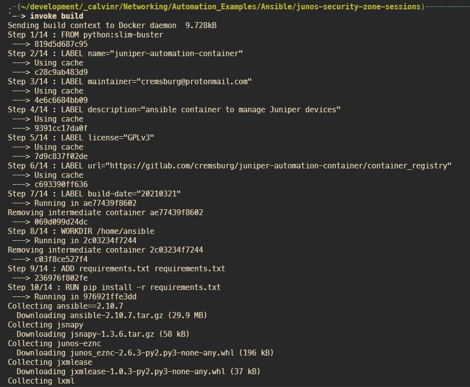
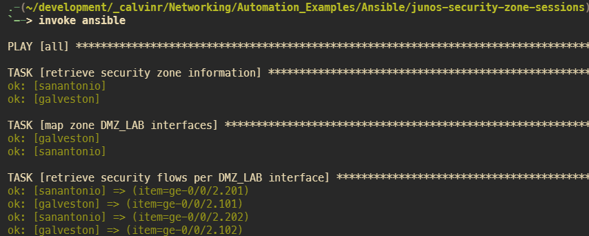
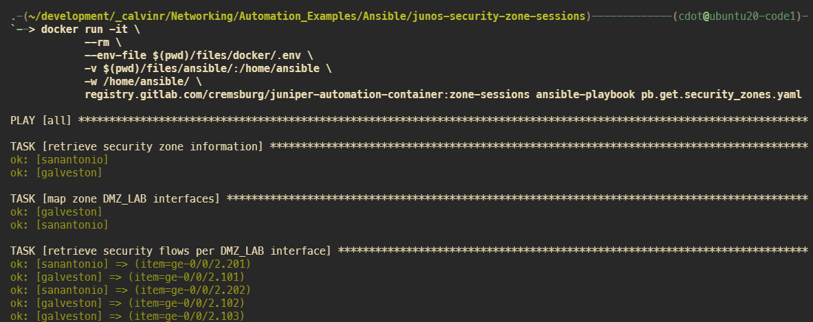

===================
Execute with Docker
===================

---------------------
With Invoke installed
---------------------

If you have `invoke`_ installed, you can use these two commands to build the container and run the playbook.

.. _invoke: https://pypi.org/project/invoke/

.. code-block:: bash

    $ invoke build
    $ invoke ansible

Build the container image

Execute the container

---------------------------------------
Without Invoke installed on your system
---------------------------------------

.. code-block:: bash

    $ docker build -t registry.gitlab.com/cremsburg/juniper-automation-container:zone-sessions files/docker/
    $ docker run -it \
            --rm \
            --env-file $(pwd)/files/docker/.env \
            -v $(pwd)/files/ansible/:/home/ansible \
            -w /home/ansible/ \
            registry.gitlab.com/cremsburg/juniper-automation-container:zone-sessions ansible-playbook pb.get.security_zones.yaml"

------------------
Notes about Docker
------------------

If you are unsure if Docker is installed on your computer, then it's probably safe to suggest that it's not. If you're interested in learning more about the product, I encourage you to read a few blogs on the topic. A personal recommendation would be 

https://www.digitalocean.com/community/tutorial_collections/how-to-install-and-use-docker

Some of the goodies placed in the `docker` folder are not relevant to our use case with Python. Feel free to delete them as you see fit, I simply wanted to share with you my Docker build process for all Juniper automation projects (including those based on Ansible). The world is your oyster and I won't judge you on whatever direction you take.