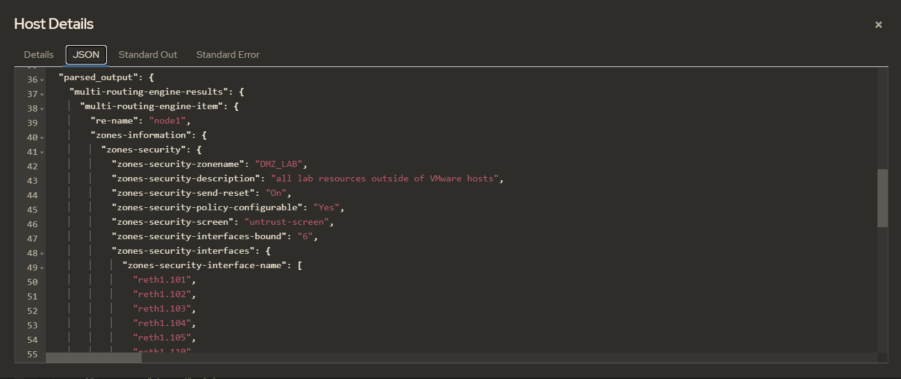

==========================
pb.get.security_zones.yaml
==========================

--------------------
get sessions by zone
--------------------

We will be breaking down each block session within the playbook.

RETRIEVE SECURITY ZONE INFORMATION
==================================

In this first block we will retrieve a list of security zones currently active on the device.

Authentication
--------------

There is an expectation that you pass your username/password combination. In the example above, we are executing the playbook through Ansible AWX/Tower, so authentication is taken care of for us.

The Docker execution will have an `.env` file for you to update with your username/password.

The native execution with Python will need to add the `user` and `passwd` as extra variables, or update the module accordingly, check out the [Docker](files/docs/execute_with_docker.rst) for an example

Example
-------

Here is the YAML defining our task from the playbook:

.. code-block:: yaml

    - name: "### RETRIEVE SECURITY ZONE INFORMATION ###"
      block:

        - name: "retrieve security zone information"
          juniper_junos_rpc:
            rpc: get-zones-information
          register: zone_information

Explanation
-----------

We leverage the Ansible module `juniper_junos_rpc` to request the list of security zones on our devices. The output is stored as a new object calls `zone_information`.

Here's an example of what `zone_information` should look like:

.. code-block:: json

  {
    "msg": "The RPC executed successfully.",
    "rpc": "get-zones-information",
    "format": "xml",
    "kwargs": null,
    "attrs": null,
    "changed": false,
    "stdout": "<zones-information style=\"detail\">\n  <zones-security>\n    <zones-security-zonename>DMZ_LAB</zones-security-zonename>\n    <zone-id>12</zone-id>\n    <zones-security-description>all lab resources outside of VMware hosts</zones-security-description>\n    <zones-security-send-reset>On</zones-security-send-reset>\n    <zones-security-policy-configurable>Yes</zones-security-policy-configurable>\n    <zones-security-screen>untrust-screen</zones-security-screen>\n    <zones-security-interfaces-bound>3</zones-security-interfaces-bound>\n    <zones-security-interfaces>\n      <zones-security-interface-name>ge-0/0/3.201</zones-security-interface-name>\n      <zones-security-interface-name>ge-0/0/3.202</zones-security-interface-name>\n      <zones-security-interface-name>ge-0/0/3.203</zones-security-interface-name>\n    </zones-security-interfaces>\n    <zones-security-advanced-connection-tracking-timeout>1800</zones-security-advanced-connection-tracking-timeout>\n    <zones-security-unidirectional-session-refreshing>No</zones-security-unidirectional-session-refreshing>\n  </zones-security>\n  <zones-security>\n    <zones-security-zonename>HOME</zones-security-zonename>\n    <zone-id>11</zone-id>\n    <zones-security-description>home networks</zones-security-description>\n    <zones-security-send-reset>Off</zones-security-send-reset>\n    <zones-security-policy-configurable>Yes</zones-security-policy-configurable>\n    <zones-security-interfaces-bound>1</zones-security-interfaces-bound>\n    <zones-security-interfaces>\n      <zones-security-interface-name>ge-0/0/3.10</zones-security-interface-name>\n    </zones-security-interfaces>\n    <zones-security-advanced-connection-tracking-timeout>1800</zones-security-advanced-connection-tracking-timeout>\n    <zones-security-unidirectional-session-refreshing>No</zones-security-unidirectional-session-refreshing>\n  </zones-security>\n  <zones-security>\n    <zones-security-zonename>INTERNET</zones-security-zonename>\n    <zone-id>10</zone-id>\n    <zones-security-description>public internet via comcast</zones-security-description>\n    <zones-security-send-reset>Off</zones-security-send-reset>\n    <zones-security-policy-configurable>Yes</zones-security-policy-configurable>\n    <zones-security-screen>untrust-screen</zones-security-screen>\n    <zones-security-interfaces-bound>1</zones-security-interfaces-bound>\n    <zones-security-interfaces>\n      <zones-security-interface-name>ge-0/0/1.0</zones-security-interface-name>\n    </zones-security-interfaces>\n    <zones-security-advanced-connection-tracking-timeout>1800</zones-security-advanced-connection-tracking-timeout>\n    <zones-security-unidirectional-session-refreshing>No</zones-security-unidirectional-session-refreshing>\n  </zones-security>\n  <zones-security>\n    <zones-security-zonename>trust</zones-security-zonename>\n    <zone-id>7</zone-id>\n    <zones-security-send-reset>On</zones-security-send-reset>\n    <zones-security-policy-configurable>Yes</zones-security-policy-configurable>\n    <zones-security-interfaces-bound>0</zones-security-interfaces-bound>\n    <zones-security-interfaces/>\n    <zones-security-advanced-connection-tracking-timeout>1800</zones-security-advanced-connection-tracking-timeout>\n    <zones-security-unidirectional-session-refreshing>No</zones-security-unidirectional-session-refreshing>\n  </zones-security>\n  <zones-security>\n    <zones-security-zonename>untrust</zones-security-zonename>\n    <zone-id>8</zone-id>\n    <zones-security-send-reset>Off</zones-security-send-reset>\n    <zones-security-policy-configurable>Yes</zones-security-policy-configurable>\n    <zones-security-screen>untrust-screen</zones-security-screen>\n    <zones-security-interfaces-bound>0</zones-security-interfaces-bound>\n    <zones-security-interfaces/>\n    <zones-security-advanced-connection-tracking-timeout>1800</zones-security-advanced-connection-tracking-timeout>\n    <zones-security-unidirectional-session-refreshing>No</zones-security-unidirectional-session-refreshing>\n  </zones-security>\n  <zones-security>\n    <zones-security-zonename>junos-host</zones-security-zonename>\n    <zone-id>2</zone-id>\n    <zones-security-send-reset>Off</zones-security-send-reset>\n    <zones-security-policy-configurable>Yes</zones-security-policy-configurable>\n    <zones-security-interfaces-bound>0</zones-security-interfaces-bound>\n    <zones-security-interfaces/>\n    <zones-security-advanced-connection-tracking-timeout>1800</zones-security-advanced-connection-tracking-timeout>\n    <zones-security-unidirectional-session-refreshing>No</zones-security-unidirectional-session-refreshing>\n  </zones-security>\n</zones-information>\n",
    "stdout_lines": [
      "<zones-information style=\"detail\">",
      "  <zones-security>",
      "    <zones-security-zonename>DMZ_LAB</zones-security-zonename>",
      "    <zone-id>12</zone-id>",
      "    <zones-security-description>all lab resources outside of VMware hosts</zones-security-description>",
      "    <zones-security-send-reset>On</zones-security-send-reset>",
      "    <zones-security-policy-configurable>Yes</zones-security-policy-configurable>",
      "    <zones-security-screen>untrust-screen</zones-security-screen>",
      "    <zones-security-interfaces-bound>3</zones-security-interfaces-bound>",
      "    <zones-security-interfaces>",
      "      <zones-security-interface-name>ge-0/0/3.201</zones-security-interface-name>",
      "      <zones-security-interface-name>ge-0/0/3.202</zones-security-interface-name>",
      "      <zones-security-interface-name>ge-0/0/3.203</zones-security-interface-name>",
      "    </zones-security-interfaces>",
      "    <zones-security-advanced-connection-tracking-timeout>1800</zones-security-advanced-connection-tracking-timeout>",
      "    <zones-security-unidirectional-session-refreshing>No</zones-security-unidirectional-session-refreshing>",
      "  </zones-security>",
      "  <zones-security>",
      "    <zones-security-zonename>HOME</zones-security-zonename>",
      "    <zone-id>11</zone-id>",
      "    <zones-security-description>home networks</zones-security-description>",
      "    <zones-security-send-reset>Off</zones-security-send-reset>",
      "    <zones-security-policy-configurable>Yes</zones-security-policy-configurable>",
      "    <zones-security-interfaces-bound>1</zones-security-interfaces-bound>",
      "    <zones-security-interfaces>",
      "      <zones-security-interface-name>ge-0/0/3.10</zones-security-interface-name>",
      "    </zones-security-interfaces>",
      "    <zones-security-advanced-connection-tracking-timeout>1800</zones-security-advanced-connection-tracking-timeout>",
      "    <zones-security-unidirectional-session-refreshing>No</zones-security-unidirectional-session-refreshing>",
      "  </zones-security>",
      "  <zones-security>",
      "    <zones-security-zonename>INTERNET</zones-security-zonename>",
      "    <zone-id>10</zone-id>",
      "    <zones-security-description>public internet via comcast</zones-security-description>",
      "    <zones-security-send-reset>Off</zones-security-send-reset>",
      "    <zones-security-policy-configurable>Yes</zones-security-policy-configurable>",
      "    <zones-security-screen>untrust-screen</zones-security-screen>",
      "    <zones-security-interfaces-bound>1</zones-security-interfaces-bound>",
      "    <zones-security-interfaces>",
      "      <zones-security-interface-name>ge-0/0/1.0</zones-security-interface-name>",
      "    </zones-security-interfaces>",
      "    <zones-security-advanced-connection-tracking-timeout>1800</zones-security-advanced-connection-tracking-timeout>",
      "    <zones-security-unidirectional-session-refreshing>No</zones-security-unidirectional-session-refreshing>",
      "  </zones-security>",
      "  <zones-security>",
      "    <zones-security-zonename>trust</zones-security-zonename>",
      "    <zone-id>7</zone-id>",
      "    <zones-security-send-reset>On</zones-security-send-reset>",
      "    <zones-security-policy-configurable>Yes</zones-security-policy-configurable>",
      "    <zones-security-interfaces-bound>0</zones-security-interfaces-bound>",
      "    <zones-security-interfaces/>",
      "    <zones-security-advanced-connection-tracking-timeout>1800</zones-security-advanced-connection-tracking-timeout>",
      "    <zones-security-unidirectional-session-refreshing>No</zones-security-unidirectional-session-refreshing>",
      "  </zones-security>",
      "  <zones-security>",
      "    <zones-security-zonename>untrust</zones-security-zonename>",
      "    <zone-id>8</zone-id>",
      "    <zones-security-send-reset>Off</zones-security-send-reset>",
      "    <zones-security-policy-configurable>Yes</zones-security-policy-configurable>",
      "    <zones-security-screen>untrust-screen</zones-security-screen>",
      "    <zones-security-interfaces-bound>0</zones-security-interfaces-bound>",
      "    <zones-security-interfaces/>",
      "    <zones-security-advanced-connection-tracking-timeout>1800</zones-security-advanced-connection-tracking-timeout>",
      "    <zones-security-unidirectional-session-refreshing>No</zones-security-unidirectional-session-refreshing>",
      "  </zones-security>",
      "  <zones-security>",
      "    <zones-security-zonename>junos-host</zones-security-zonename>",
      "    <zone-id>2</zone-id>",
      "    <zones-security-send-reset>Off</zones-security-send-reset>",
      "    <zones-security-policy-configurable>Yes</zones-security-policy-configurable>",
      "    <zones-security-interfaces-bound>0</zones-security-interfaces-bound>",
      "    <zones-security-interfaces/>",
      "    <zones-security-advanced-connection-tracking-timeout>1800</zones-security-advanced-connection-tracking-timeout>",
      "    <zones-security-unidirectional-session-refreshing>No</zones-security-unidirectional-session-refreshing>",
      "  </zones-security>",
      "</zones-information>"
    ],
    "parsed_output": {
      "zones-information": {
        "zones-security": [
          {
            "zones-security-zonename": "DMZ_LAB",
            "zone-id": "12",
            "zones-security-description": "all lab resources outside of VMware hosts",
            "zones-security-send-reset": "On",
            "zones-security-policy-configurable": "Yes",
            "zones-security-screen": "untrust-screen",
            "zones-security-interfaces-bound": "3",
            "zones-security-interfaces": {
              "zones-security-interface-name": [
                "ge-0/0/3.201",
                "ge-0/0/3.202",
                "ge-0/0/3.203"
              ]
            },
            "zones-security-advanced-connection-tracking-timeout": "1800",
            "zones-security-unidirectional-session-refreshing": "No"
          },
          {
            "zones-security-zonename": "HOME",
            "zone-id": "11",
            "zones-security-description": "home networks",
            "zones-security-send-reset": "Off",
            "zones-security-policy-configurable": "Yes",
            "zones-security-interfaces-bound": "1",
            "zones-security-interfaces": {
              "zones-security-interface-name": "ge-0/0/3.10"
            },
            "zones-security-advanced-connection-tracking-timeout": "1800",
            "zones-security-unidirectional-session-refreshing": "No"
          },
          {
            "zones-security-zonename": "INTERNET",
            "zone-id": "10",
            "zones-security-description": "public internet via comcast",
            "zones-security-send-reset": "Off",
            "zones-security-policy-configurable": "Yes",
            "zones-security-screen": "untrust-screen",
            "zones-security-interfaces-bound": "1",
            "zones-security-interfaces": {
              "zones-security-interface-name": "ge-0/0/1.0"
            },
            "zones-security-advanced-connection-tracking-timeout": "1800",
            "zones-security-unidirectional-session-refreshing": "No"
          },
          {
            "zones-security-zonename": "trust",
            "zone-id": "7",
            "zones-security-send-reset": "On",
            "zones-security-policy-configurable": "Yes",
            "zones-security-interfaces-bound": "0",
            "zones-security-interfaces": "",
            "zones-security-advanced-connection-tracking-timeout": "1800",
            "zones-security-unidirectional-session-refreshing": "No"
          },
          {
            "zones-security-zonename": "untrust",
            "zone-id": "8",
            "zones-security-send-reset": "Off",
            "zones-security-policy-configurable": "Yes",
            "zones-security-screen": "untrust-screen",
            "zones-security-interfaces-bound": "0",
            "zones-security-interfaces": "",
            "zones-security-advanced-connection-tracking-timeout": "1800",
            "zones-security-unidirectional-session-refreshing": "No"
          },
          {
            "zones-security-zonename": "junos-host",
            "zone-id": "2",
            "zones-security-send-reset": "Off",
            "zones-security-policy-configurable": "Yes",
            "zones-security-interfaces-bound": "0",
            "zones-security-interfaces": "",
            "zones-security-advanced-connection-tracking-timeout": "1800",
            "zones-security-unidirectional-session-refreshing": "No"
          }
        ]
      }
    },
    "invocation": {
      "module_args": {
        "rpc": "get-zones-information",
        "user": "awx",
        "passwd": "VALUE_SPECIFIED_IN_NO_LOG_PARAMETER",
        "host": "192.168.105.146",
        "rpcs": [
          "get-zones-information"
        ],
        "return_output": true,
        "timeout": 30,
        "formats": null,
        "kwargs": null,
        "attrs": null,
        "filter": null,
        "dest": null,
        "dest_dir": null,
        "ignore_warning": null,
        "cs_user": null,
        "cs_passwd": null,
        "ssh_private_key_file": null,
        "ssh_config": null,
        "mode": null,
        "console": null,
        "port": 830,
        "baud": null,
        "attempts": null,
        "provider": null,
        "logfile": null,
        "logdir": null,
        "level": null
      }
    },
    "_ansible_no_log": false
  }

Example output from the task's execution within Ansible AWX

MAP INTERFACES TO NEW LIST OBJECTS
==================================

The path for filter plugins is found in the Ansible directory

.. code-block:: yaml

    - name: "### MAP INTERFACES TO NEW LIST OBJECTS ###"
      block:

        - name: "map zone DMZ_LAB interfaces"
          ansible.builtin.set_fact:
            zone_ifaces: "{{ zone_information['parsed_output'] | get_zone_interfaces  }}"

Explanation
-----------

We run the output through a filter plugin called get_zone_interfaces.py

The idea here is to align interfaces with their security zone, returning a dictionary of three lists. 

Here's an example of what `zone_information` should look like:

.. code-block:: json

    {
      "zone_ifaces": {
        "dmz_lab_interfaces": [
          "ge-0/0/3.101",
          "ge-0/0/3.102",
          "ge-0/0/3.103"
        ],
        "home_interfaces": [
          "ge-0/0/3.10"
        ],
        "internet_interfaces": [
          "ge-0/0/1.0"
        ]
      }
    }

`flows_dmz_lab`
---------------

Here we loop over the DMZ list found within `zone_ifaces`. Each interface will create a seperate RPC call to find out how many security sessions are flowing through it.

.. code-block:: yaml

    - name: "### RETRIEVE SECURITY FLOWS PER INTERFACE ###"
      block:
        - name: "retrieve security flows per DMZ_LAB interface"
          juniper_junos_rpc:
            rpc: get-flow-session-information
            kwargs:
              interface: "{{ item }}"
              summary: null
          loop: "{{ zone_ifaces['dmz_lab_interfaces'] }}"
          register: flows_dmz_lab

example
-------

.. code-block:: json

    {
      "msg": "The RPC executed successfully.",
      "rpc": "get-flow-session-information",
      "format": "xml",
      "kwargs": {
        "interface": "ge-0/0/3.201",
        "summary": null
      },
      "attrs": null,
      "changed": false,
      "stdout": "<security-flow-information>\n  <flow-session-information>\n    <displayed-session-valid>0</displayed-session-valid>\n    <displayed-session-pending>0</displayed-session-pending>\n    <displayed-session-invalidated>0</displayed-session-invalidated>\n    <displayed-session-other>0</displayed-session-other>\n    <displayed-session-count>0</displayed-session-count>\n  </flow-session-information>\n</security-flow-information>\n",
      "stdout_lines": [
        "<security-flow-information>",
        "  <flow-session-information>",
        "    <displayed-session-valid>0</displayed-session-valid>",
        "    <displayed-session-pending>0</displayed-session-pending>",
        "    <displayed-session-invalidated>0</displayed-session-invalidated>",
        "    <displayed-session-other>0</displayed-session-other>",
        "    <displayed-session-count>0</displayed-session-count>",
        "  </flow-session-information>",
        "</security-flow-information>"
      ],
      "parsed_output": {
        "security-flow-information": {
          "flow-session-information": {
            "displayed-session-valid": "0",
            "displayed-session-pending": "0",
            "displayed-session-invalidated": "0",
            "displayed-session-other": "0",
            "displayed-session-count": "0"
          }
        }
      },
      "invocation": {
        "module_args": {
          "rpc": "get-flow-session-information",
          "kwargs": "{'interface': 'ge-0/0/3.201', 'summary': None}",
          "user": "awx",
          "passwd": "VALUE_SPECIFIED_IN_NO_LOG_PARAMETER",
          "host": "192.168.105.146",
          "rpcs": [
            "get-flow-session-information"
          ],
          "return_output": true,
          "timeout": 30,
          "formats": null,
          "attrs": null,
          "filter": null,
          "dest": null,
          "dest_dir": null,
          "ignore_warning": null,
          "cs_user": null,
          "cs_passwd": null,
          "ssh_private_key_file": null,
          "ssh_config": null,
          "mode": null,
          "console": null,
          "port": 830,
          "baud": null,
          "attempts": null,
          "provider": null,
          "logfile": null,
          "logdir": null,
          "level": null
        }
      },
      "_ansible_no_log": false,
      "item": "ge-0/0/3.201",
      "ansible_loop_var": "item",
      "_ansible_item_label": "ge-0/0/3.201"
    }

Rinse / repeat
==============

Above step is repeated for other security zones