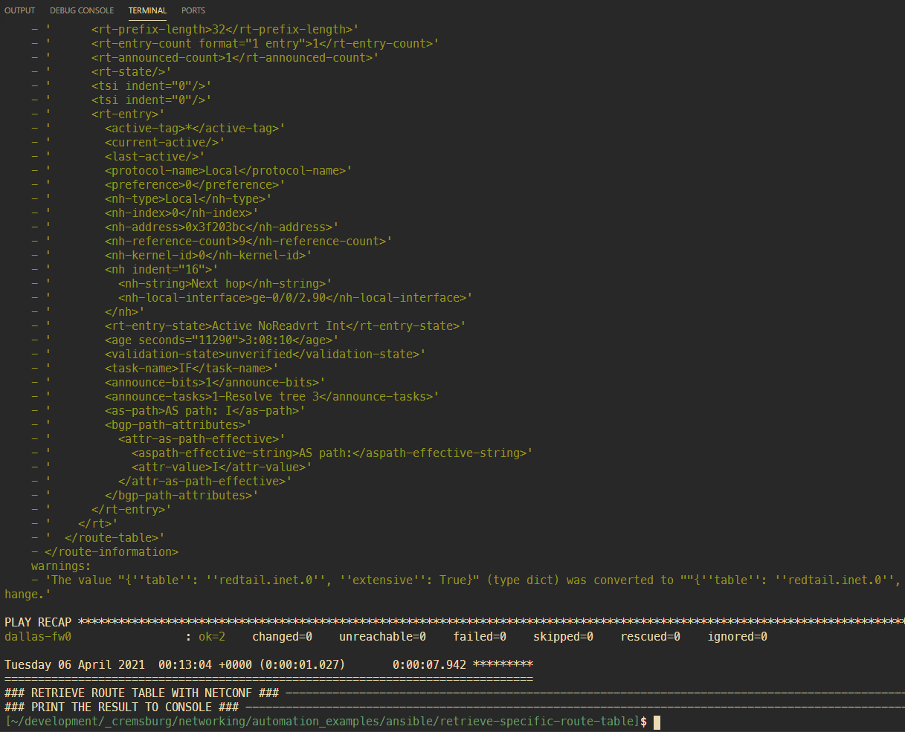

# NETCONF EXAMPLE: GET SPECIFIC ROUTER TABLE

This example will show how to use Ansible to perform a remote procedure call (RPC) to Juniper's NETCONF API. 

## To run the playbook

Two options provided:

### Dockerfile

1. build the container image with

```sh
make container
```

2. run the playbook within the container

```sh
make ansible
```

### Your own Python environment

1. install python dependencies 

```sh
pip install -r docker/requirements.txt
```

2. change into Ansible directory 

```
cd ansible
```

3. install Juniper Ansible modules 

```sh
ansible-galaxy install juniper.junos
```

4. type 

```sh
ansible-playbook pb.retrieve.route.table.yml
```

## Dependencies

Official Juniper Ansible modules

```sh
ansible-galaxy install juniper.junos
```

## How it works

The playbook works like this:

- We will be requesting the route table information
- The output will be stored as an object called `route_table`
- We print the object's "parsed_output" dictionary to the terminal

## examples screenshot

