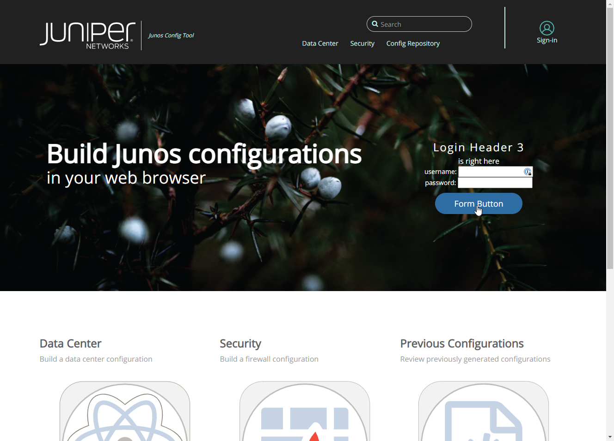

# Junos Configuration Web Application

[](https://www.juniper.net/us/en.html)

## Overview

This JavaScript based project aims to simplify the creation of configurations used by devices running Junos.

> This project is still active development

## 📜 Preparing your JavaScript environment

As standard with most JavaScript projects, the `packages.json` file found in `files/nodejs` directory contains a couple of scripts to help you get off the ground and running

1. install JavaScript dependencies

```bash
npm install
```

## ⚠️ Update your database path

If you have decided to use a native NodeJS deployment, please make sure to update the path for your database connection parameters in the following files before proceededing.

- [files/nodejs/src/routers/adminRouter.js](https://gitlab.com/_calvinr/web/javascript/junos-configuration/-/blob/master/files/nodejs/src/routers/adminRouter.js)
- [files/nodejs/src/routers/authRouter.js](https://gitlab.com/_calvinr/web/javascript/junos-configuration/-/blob/master/files/nodejs/src/routers/authRouter.js)
- [files/nodejs/src/routers/configsRouter.js](https://gitlab.com/_calvinr/web/javascript/junos-configuration/-/blob/master/files/nodejs/src/routers/configsRouter.js)
- [files/nodejs/src/config/strategies/local.strategy.js](https://gitlab.com/_calvinr/web/javascript/junos-configuration/-/blob/master/files/nodejs/src/config/strategies/local.strategy.js)

Container based deployments can continue with the defaults, but you'd likely want to polish them up before shipping into production.

## Running the web application

You have a couple of paths to choose from when launching the web application

1. Native NodeJS with MongoDB server
2. Container based

Container based is the easier two deployment options, as you don't need to concern yourself with setting up MongoDB. Regardless of which path you choose, there is a `Makefile` in the root of the project to help simplify your interactions.

### Native NodeJS with a MongoDB server

In the project's root folder, change into the directory containing the web application.

```bash
cd files/nodejs
```

Install the dependencies (one time operation only)

```bash
npm install
```

Start your web application

```bash
npm start
```

### 🐳 Container based

build the container image with

```bash
make build
```

Run the applications with

```bash
make start
```

### 〰️ `Notes about Docker`

If you are unsure if Docker is installed on your computer, then it's probably safe to suggest that it's not. If you're interested in learning more about the product, I encourage you to read a few blogs on the topic. A personal recommendation would be [Digital Ocean](https://www.digitalocean.com/community/tutorial_collections/how-to-install-and-use-docker#:~:text=Docker%20is%20an%20application%20that,on%20the%20host%20operating%20system.)

Some of the goodies placed in the `docker` folder are not relevant to our use case with Python. Feel free to delete them as you see fit, I simply wanted to share with you my Docker build process for all Juniper automation projects (including those based on Ansible). The world is your oyster and I won't judge you on whatever direction you take.

## 📝 `Dependencies`

Refer to the `packages.json` file located at [files/nodejs/package-lock.js](https://gitlab.com/_calvinr/web/javascript/junos-configuration/-/blob/master/files/nodejs/package-lock.json) for detailed descriptions on each package installed.

## ⚙️ `How it works`

Coming soon
## 📸 `Screenshot`


