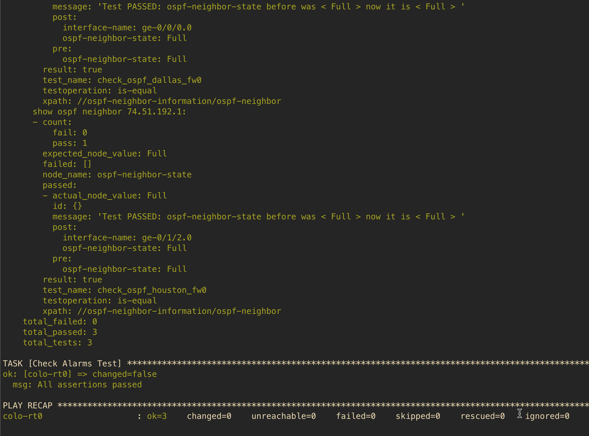

# Ansible Automation Example: JSNAPY PRE/POST Upgrade Validation

[](https://junos-ansible-modules.readthedocs.io/en/stable/)

## Overview

This example will show how to validate the status of our firewall before and after a software upgrade. This project will leverage JSNAPY over NETCONF RPCs.

In addition to the Ansible playbok, this project also ships with additional tools to help you along your way. You will find a Dockerfile for running the project in an isolated environment, and a Makefile for those of us that hate typing out everything all the time.

## 🚀 `Executing the playbook`

This project provides two unique methods of executing the playbook:

1. Docker
2. Your own Python environment

### 🐳 `Docker`

#### With Invoke installed on your machine

If you have [invoke](https://pypi.org/project/invoke/) installed, you can use these two commands to build the container and run the playbook.

1. build the container image with

```bash
$ invoke container
```

2. run the playbook to push the network configuration changes

```bash
$ invoke ansible
```

#### Without Invoke installed on your system

1. build the container image with

```bash
$ docker build -t registry.gitlab.com/cremsburg/juniper-automation-container:jsnapy-ospf files/docker/
```

2. run the playbook to push the network configuration changes

```bash
$ docker run -it --rm \
    -v $PWD/files/:/home/tmp/files \
    -v $PWD/files/:/home/tmp/files \
    -w /home/tmp/files/ansible/ \
    registry.gitlab.com/cremsburg/juniper-automation-container:jsnapy-ospf ansible-playbook pb.jsnapy.ospf.yaml
```

#### 〰️ `Notes about Docker`

If you are unsure if Docker is installed on your computer, then it's probably safe to suggest that it's not. If you're interested in learning more about the product, I encourage you to read a few blogs on the topic. A personal recommendation would be [Digital Ocean](https://www.digitalocean.com/community/tutorial_collections/how-to-install-and-use-docker#:~:text=Docker%20is%20an%20application%20that,on%20the%20host%20operating%20system.)

Some of the goodies placed in the `docker` folder are not relevant to our use case with Python. Feel free to delete them as you see fit, I simply wanted to share with you my Docker build process for all Juniper automation projects (including those based on Ansible). The world is your oyster and I won't judge you on whatever direction you take.

### 🐍 `Your own Python environment`

I have included a Poetry file for anyone saavy enough to take advantage. For the uninitiated, Poetry helps replicate Python environments between users with a single file. You'll need to have Poetry installed on your machine, for most users that will be solved with `pip install poetry`.

This is optional, I will share the methods of going with Poetry or without

1. install Python dependencies 

1a. with Poetry

```bash
$ poetry install
```

1b. without Poetry

```bash
$ python3 -m venv venv
$ source venv/bin/activate
$ pip install -r files/docker/requirements.txt
```

2. change into Ansible directory 

```bash
$ cd files/ansible
```

3. install official Ansible roles for Juniper devices

```bash
$ ansible-galaxy install juniper.junos
```

4. run your Ansible playbook

```bash
$ ansible-playbook pb.jsnapy.ospf.yaml -i ../docker/inventory.yaml
```

⚠️ Running into an error about junos-eznc? ⚠️

There's an annoyance with Ansible and the way it interacts with your Python virtual environment. Do not let that frustrate you to the point that you ditch virtual environments altogether, instead use this quick technique to fix the problem.

From your terminal, find out the full path to Python within your virtual environment

```bash
$ which python
/home/cdot/.cache/pypoetry/virtualenvs/jsnapy-ospf-X7Chj_yD-py3.8/bin/python
```

Copy the output from your command and update the `ansible.cfg` file found in the same directory as the playbook. Do *not* update the `ansible.cfg` file in the root of this project, that won't accomplish anything.

add the following line to your `ansible.cfg` file, make sure to paste in the output of your clipboard rather than use my example

```ini
interpreter_python = /home/cdot/.cache/pypoetry/virtualenvs/jsnapy-ospf-X7Chj_yD-py3.8/bin/python
```

Sorry about that, one day Ansible will get it right. Until then, I recommend considering the Docker approach.

#### 〰️ `Notes about Python Virtual Environments`

Similar to Docker, if you are unsure if you're using Python Virtual Environment features, it is safe to suggest that you're not. You are *strongly* recommended to using a Python Virtual Environment everywhere. You can really mess up your machine if you're too lazy and say "ehh, that seems like it's not important". It is. If it sounds like I'm speaking from experience, well I'll never admit to it.

If you're interested in learning more about setting up Virtual Environments, I encourage you to read a few blogs on the topic. A personal recommendation would be

- [Digital Ocean (macOS)](https://www.digitalocean.com/community/tutorials/how-to-install-python-3-and-set-up-a-local-programming-environment-on-macos)
- [Digital Ocean (Windows 10)](https://www.digitalocean.com/community/tutorials/how-to-install-python-3-and-set-up-a-local-programming-environment-on-windows-10)

## 📝 `Dependencies`

Refer to the Poetry Lock file located at [poetry.lock](poetry.lock) for detailed descriptions on each package installed.

## ⚙️ `How it works`

Let's take a second to do a nice John Madden play-by-play by visiting the documentation in the `files/docs/` directory.

Name | Description
---- | -----------
[pb.jsnapy.ospf.rst](files/docs/pb.jsnapy.ospf.rst)|Validate OSPF neighbors with JSNAPY

## 〰️ `Just an FYI for Ansible AWX / Tower users`

You'll note that there is an `ansible.cfg` file found in the root of the project's directory, as well as a folder `roles/` to host the `requirements.yml` file. 

The only purpose these serve is for Ansible Tower, which will look for these files when the project syncs from Gitlab/Github/Whatever, and Tower will auto-install the packages. 

The `ansible.cfg` file will be the definitive for each Playbook (Template) execution, so super important to keep it here.

## 📸 `Screenshot`


