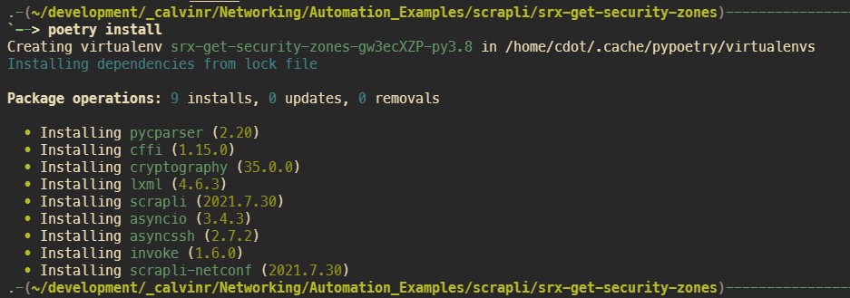
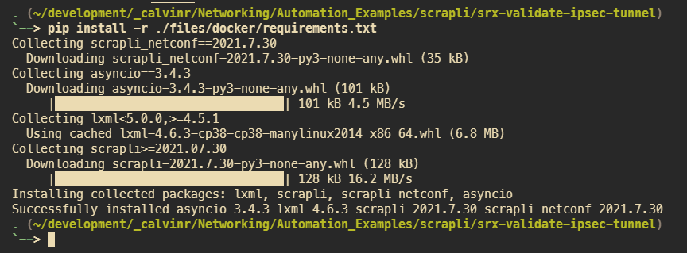

========================
Prepare Your Environment
========================

This section should only be executed once. Refer to the other section regarding execution.

---------------------
With Poetry installed
---------------------

I have included a `poetry`_ file for anyone saavy enough to take advantage. For the uninitiated, Poetry helps replicate Python environments between users with a single file. You'll need to have Poetry installed on your machine, for most users that will be solved with `pip install poetry`.

.. _poetry: https://python-poetry.org/docs/

.. code-block:: bash

    $ poetry install

---------------------------------------
Without Poetry installed on your system
---------------------------------------

Always, always, always strive to use virtual environments when working with Python. If you're needing a quick overview or refresher on Python virtual environments: 

[Digital Ocean (macOS)](https://www.digitalocean.com/community/tutorials/how-to-install-python-3-and-set-up-a-local-programming-environment-on-macos)
[Digital Ocean (Windows 10)](https://www.digitalocean.com/community/tutorials/how-to-install-python-3-and-set-up-a-local-programming-environment-on-windows-10)

.. code-block:: bash

    $ python3 -m venv venv
    $ source venv/bin/activate
    $ pip install -r files/docker/requirements.txt

==============
Execute script
==============

Execute either the synchronous or asynchronous script after you have updated them with your device parameters

.. code-block:: bash

    $ cd files/scrapli

    $ ls -ls output
    total 0

    $ python app_async.py
    
    $ ls -ls output 
    total 8
    4 -rw-rw-r-- 1 cdot cdot 78 Oct 27 10:19 192.168.105.137.yaml
    4 -rw-rw-r-- 1 cdot cdot 78 Oct 27 10:19 192.168.105.146.yaml

    $ cat output/192.168.105.146.yaml 
        - "DMZ_LAB"
        - "HOME"
        - "WAN"
        - "trust"
        - "untrust"
        - "junos-host"
