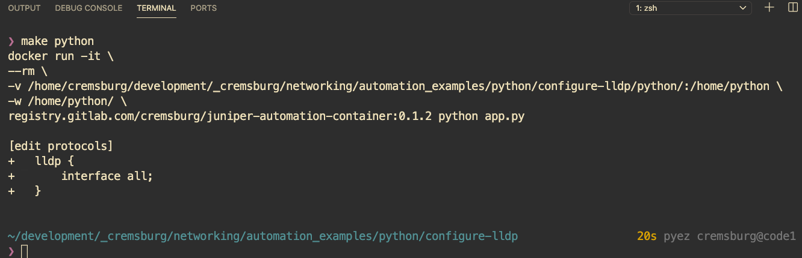

# Juniper PyEZ Example: Configure protocols LLDP

This example will show how to use PyEZ to 

1. build a NETCONF connection to a remote device
2. configure LLDP under the protocols stanza
3. diff the configuration and commit
4. print the output to the screen
5. close the connection

## 🚀 `Executing the script`

This project provides two unique methods of executing the script:

1. Docker
2. Your own Python environment

### 🐳 `Docker`

1. build the container image with

```sh
make container
```

2. run the playbook within the container

```sh
make python
```

#### 〰️ `Notes about Docker`

If you are unsure if Docker is installed on your computer, then it's probably safe to suggest that it's not. If you're interested in learning more about the product, I encourage you to read a few blogs on the topic. A personal recommendation would be [Digital Ocean](https://www.digitalocean.com/community/tutorial_collections/how-to-install-and-use-docker#:~:text=Docker%20is%20an%20application%20that,on%20the%20host%20operating%20system.)

Some of the goodies placed in the `docker` folder are not relevant to our use case with Python. Feel free to delete them as you see fit, I simply wanted to share with you my Docker build process for all Juniper automation projects (including those based on Ansible). The world is your oyster and I won't judge you on whatever direction you take.

### 🐍 `Your own Python environment`

1. install python dependencies 

```sh
pip install -r docker/requirements.txt
```

2. change into Python directory 

```
cd python
```

3. type in your terminal

```sh
python app.py
```

#### 〰️ `Notes about Python Virtual Environments`

Similar to Docker, if you are unsure if you're using Python Virtual Environment features, it is safe to suggest that you're not. You are *strongly* recommended to using a Python Virtual Environment everywhere. You can really mess up your machine if you're too lazy and say "ehh, that seems like it's not important". It is. If it sounds like I'm speaking from experience, well I'll never admit to it.

If you're interested in learning more about setting up Virtual Environments, I encourage you to read a few blogs on the topic. A personal recommendation would be

- [Digital Ocean (macOS)](https://www.digitalocean.com/community/tutorials/how-to-install-python-3-and-set-up-a-local-programming-environment-on-macos)
- [Digital Ocean (Windows 10)](https://www.digitalocean.com/community/tutorials/how-to-install-python-3-and-set-up-a-local-programming-environment-on-windows-10)

## 📝 `Dependencies`

Refer to the file located at [docker/requirements.txt](docker/requirements.txt)

## ⚙️ `How it works`

Let's take a second to do a nice John Madden play-by-play on this script:

```python
from jnpr.junos import Device
from jnpr.junos.utils.config import Config


device_connection = Device(host='dallas-fw0', user='automation', password='juniper123').open()

with Config(device_connection, mode='exclusive') as device_config:
    device_config.load('set protocols lldp interface all', format='set')
    device_config.pdiff()
    device_config.commit()

device_connection.close()
```

- We need to import the PyEZ package into our script
- Specifically, we are looking to import the `Device` method from the base `jnpr.junos` package
- `Device` will help us manage our SSH/NETCONF connection to the remote device
- `Config` will help us manage the remote device's configuration

```python
from jnpr.junos import Device
from jnpr.junos.utils.config import Config
```

- Our goal now is to build the SSH connection to the remote device
- We create a new Python object called `device_connection`, based on the parameters passed into the `Device` class
- we request "exclusive" mode for the remote device, referring to our new Class-based object as `device_config`

```python
device_connection = Device(host='dallas-fw0', user='automation', password='juniper123').open()

with Config(device_connection, mode='exclusive') as device_config:
```

- load the configuration with the parameter of "format" equal to "set"
- perform a diff on the config
- commit and close the connection

```python
    device_config.load('set protocols lldp interface all', format='set')
    device_config.pdiff()
    device_config.commit()
    device_connection.close()
```


## 📸 `Screenshot`


