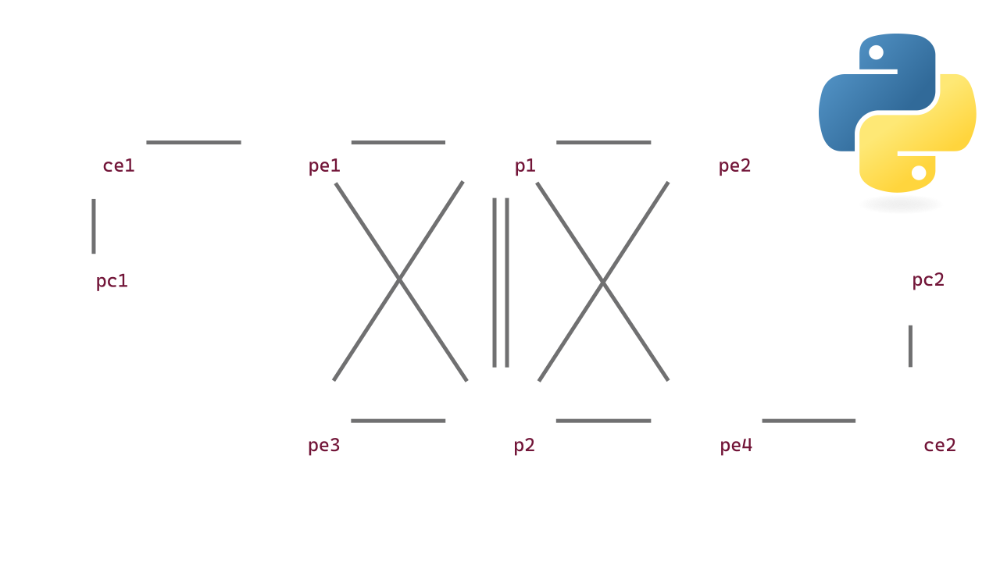
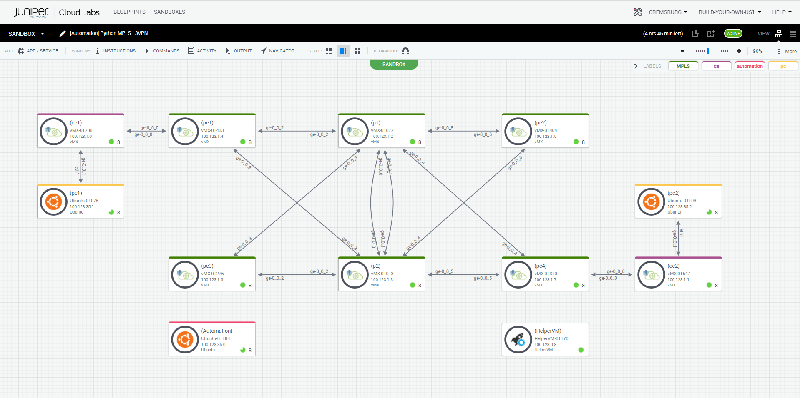
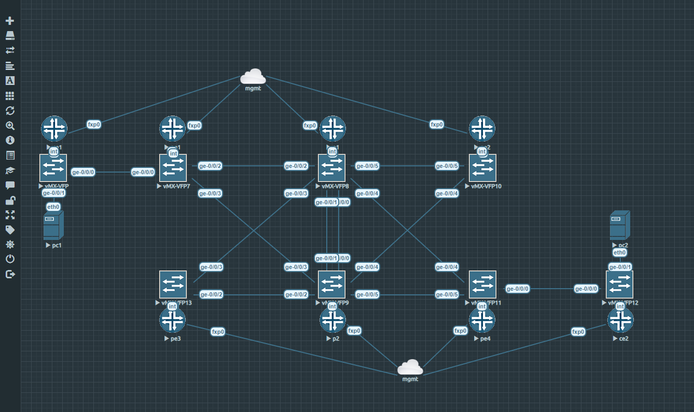

# Juniper PyEZ Config Backup

Welcome to the repository that uses PyEZ to backup configurations on devices running Junos.

---

## Documentation Site

For all information about this project, please reference the [documentation site](https://cdot65.github.io/juniper-pyez-config-backup/).

---

## Video Companion

---

## Virtualization

I am leveraging Juniper vLabs to deploy the virtualized lab, but have also included an EVE-NG topology to import if you do not have access to vLabs.

[vLabs Blueprint](https://portal.cloudlabs.juniper.net/RM/Diagram/Index/74601771-360a-4d01-80c9-c1f41f5d2438?diagramType=Topology)

_high-level design_

_Juniper vLabs_

_EVE-NG_

## Learning more

Want to learn more about what's happening? Check out our documentation [https://cdot65.github.io/juniper-pyez-config-backup/](https://cdot65.github.io/juniper-pyez-config-backup/) for a getting started guide, learning about concepts, and a breakdown of our code.

## Feedback

Have any feedback at all? 🙏 Drop me an [issue](https://github.com/cdot65/juniper-pyez-config-backup/issues).

## License

This library is licensed under the Apache 2.0 License.
