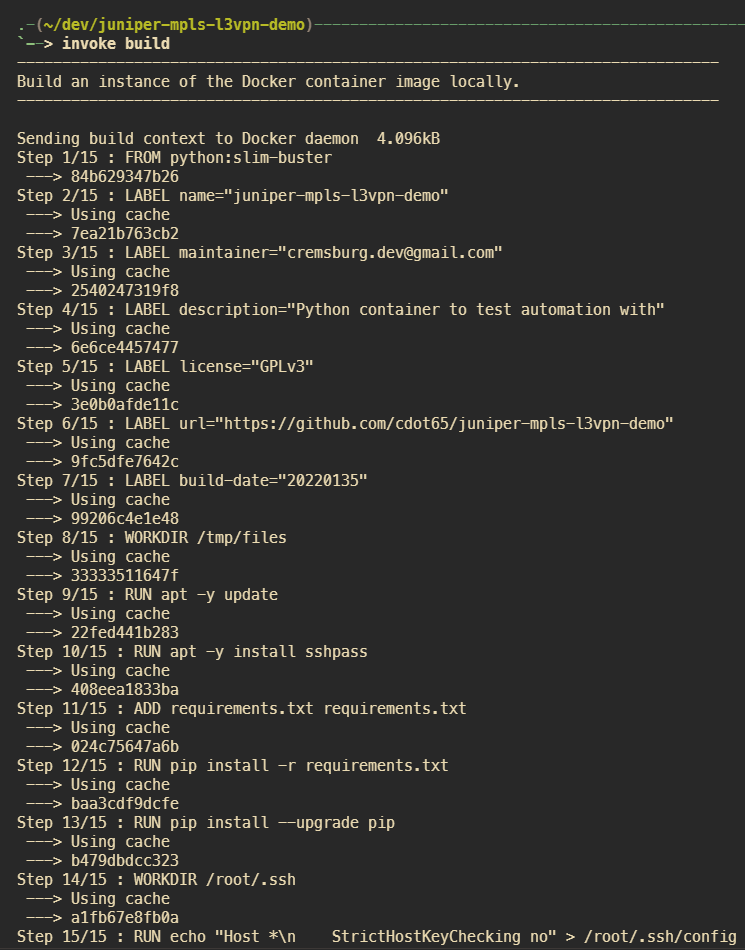
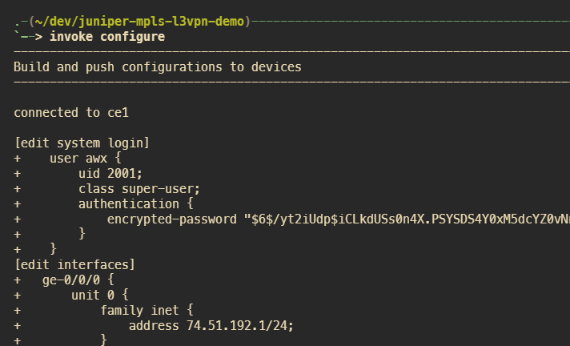

## 📌 Overview

You will find a packaged called [Invoke](http://www.pyinvoke.org/) installed within your poetry's virtual environment.

Invoke is an elegant way to create CLI shortcuts for commands that are long to type out. Here is a short list of some of the Invoke operations created in the `tasks.py` file.

| Command            | Action                                              |
| ------------------ | --------------------------------------------------- |
| `invoke generate`  | Build the configurations locally with Jinaj2.       |
| `invoke configure` | Build and push our configurations with PyEZ.        |
| `invoke download`  | Download our configurations with PyEZ.              |
| `invoke rollback`  | Rollback to our bootstrap configurations with PyEZ. |
| `invoke validate`  | Validate our security configuration with JSNAPy.    |

---

## 🚀 Workflow

The workflow will look like this:

1. Have Poetry install your Python packages in a virtual environment (one-time operation)
2. Activate your new virtual environment with Poetry
3. Build Docker container image (one-time operation)
4. Access the container's bash shell for running scripts without Invoke
5. Configure your SRX firewall

```bash
poetry install
poetry shell
invoke build
invoke shell
invoke configure
```

## 📸 Screenshots





