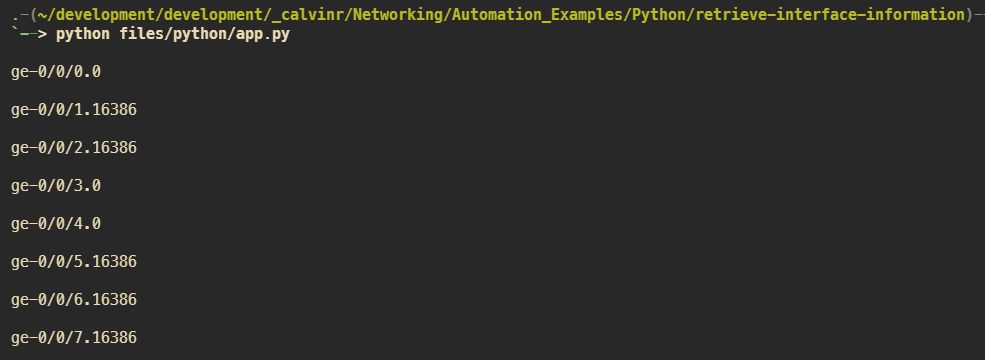

# Juniper PyEZ Example: Retrieve Interface information

This example will show how to use PyEZ to 

1. build a NETCONF connection to a remote device
2. request extensive interface information
3. filter output based on XML XPATH
4. print the output to the screen
5. close the connection

## 🚀 `Workflow`

We have provided a [Poetry](https://python-poetry.org/docs/) lock file to make life simple when managing Python packages and virtual environments. Within the virtual vironment, there will be a package called [Invoke](http://www.pyinvoke.org/) that will help us run our script with a simple command.

The workflow will look like this:

1. Install Poetry (one-time operation)
2. Have Poetry install your Python packages in a virtual environment (one-time operation)
3. Activate your new virtual environment with Poetry
4. Run locally or within a container using the Invoke package

### 🐍 `Activate your Python environment (one time operation)`

1. install poetry package to manage our Python virtual environment 

```sh
curl -sSL https://raw.githubusercontent.com/python-poetry/poetry/master/get-poetry.py | python -
```

2. install our Python dependencies 

```sh
poetry install
```

3. activate your Python virtual environment

```sh
poetry shell
```

### `Executing the script`

1. run your Python script locally

```sh
python files/python/app.py
```

### `Using Docker`

1. build the container image with

```sh
invoke build
```

2. run the python script within the container

```sh
invoke python
```

### 📝 `Additional Notes`

#### 🐍 `Python`

You are *strongly* recommended to using a Python Virtual Environment any and everywhere possible. You can really mess up your machine if you're too lazy and say "ehh, that seems like it's not important". It is. If it sounds like I'm speaking from experience, I'll never admit to it.

If you're interested in learning more about setting up Virtual Environments, I encourage you to read a few blogs on the topic. A personal recommendation would be

- [Poetry](https://python-poetry.org/docs/)
- [Digital Ocean (macOS)](https://www.digitalocean.com/community/tutorials/how-to-install-python-3-and-set-up-a-local-programming-environment-on-macos)
- [Digital Ocean (Windows 10)](https://www.digitalocean.com/community/tutorials/how-to-install-python-3-and-set-up-a-local-programming-environment-on-windows-10)

#### 🐳 `Docker`

If you are unsure if Docker is installed on your computer, then it's probably safe to suggest that it's not. If you're interested in learning more about the product, I encourage you to read a few blogs on the topic. A personal recommendation would be [Digital Ocean](https://www.digitalocean.com/community/tutorial_collections/how-to-install-and-use-docker#:~:text=Docker%20is%20an%20application%20that,on%20the%20host%20operating%20system.)

Some of the goodies placed in the `docker` folder are not relevant to our use case with Python. Feel free to delete them as you see fit, I simply wanted to share with you my Docker build process for all Juniper automation projects (including those based on Ansible). The world is your oyster and I won't judge you on whatever direction you take.

#### 📝 `Dependencies`

Refer to the file located at [files/docker/requirements.txt](files/docker/requirements.txt)

## ⚙️ `How it works`

Let's take a second to do a nice John Madden play-by-play on this script:

### `Importing the functionality of PyEZ and XML into our script`

```python
from jnpr.junos import Device
from lxml import etree
import xml.dom.minidom
```

- We need to import the PyEZ package into our script
- Specifically, we are looking to import the `Device` method from PyEZ
  - `Device` will help us manage our SSH/NETCONF connection to the remote device
  - `etree` will make working with XML inside of Python possible
  - `xml.dom.minidom` helps with filtering in certain examples

### `Define several RPC filters`

You may or may not use these, leaving as examples

```python
xpath_physical_interface_names = '//physical-interface/name/text()'
xpath_logical_interface_names = '//physical-interface/logical-interface/name/text()'
xpath_physical_and_logical_interface_names = '//physical-interface/name/text()|//physical-interface/logical-interface/name/text()'
xpath_physical_and_logical_interface_xml = '//physical-interface|//physical-interface/logical-interface'
xpath_physical_logical_interface_names_irb = 'physical-interface/logical-interface[contains(name, "irb")]/name/text()'
xpath_physical_logical_interface_names_ge = 'physical-interface/logical-interface[contains(name, "ge")]/name/text()'
```

### `Open NETCONF session to device`

```python
with Device(host='ce1', user='automation', password='juniper123') as network_device:
```

- Our goal now is to build the SSH connection to the remote device
- We create a new Python object called `network_device`, based on the parameters passed into the `Device` class

### `Sending our API call`

```python
    rpc = network_device.rpc.get_interface_information(extensive=True)
    physical_logical_interface_names_ge = rpc.xpath(xpath_physical_logical_interface_names_ge)
```

- request the Extensive output from a `show interfaces` command
- create a new object called `physical_logical_interface_names_ge`, filtering based on any interface with `ge` in the name

### `Filter and print`

```python
    for each in physical_logical_interface_names_ge:
        each = each.rstrip('\n')
        print(each)
```

Loop over the `physical_logical_interface_names_ge` object, strip the extra newline character `\n`, and print each interface to screen

## 📸 `Screenshot`


